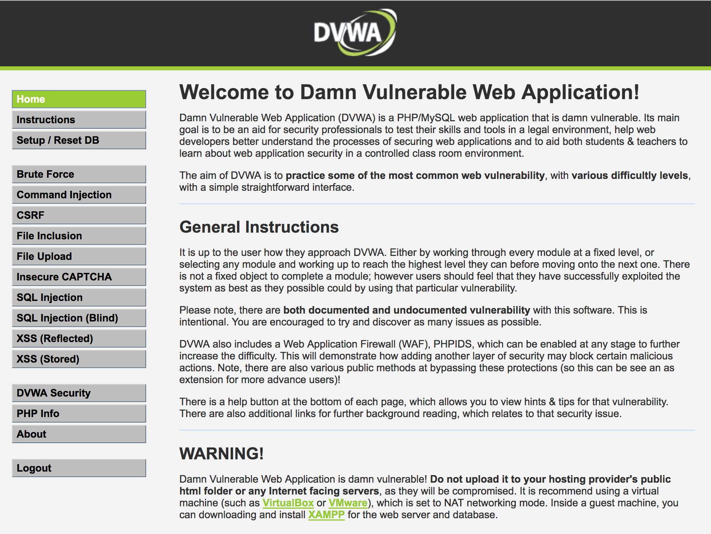

# Overview

This is a basic configuartion of a Web Application firewall (WAF). 

WAF can opperate in two modes, one where the WAF is placed in front of CloudFront and a second mode where it is placed in front of an Application Load Balancer (ALB).


The deployment sets up a basic WAF ACL with a rule to block SQL injection, however it is simple to extend to add additional rules for XXS or rate limiting.

The web servers are configured with with an ethical hacking site known to be susceptable to SQL injection and XXS.

There is a third server configured with ZAP, https://github.com/zaproxy/zaproxy/wiki/Docker. This brings up a web interface which can be used to perform vaiours attacks against the site.

# Setup

To deploy the infrastructure utilise CloudFormation. To do this via the CLI run:

```
aws cloudformation create-stack --stack-name wafDemo --template-body file://./waf.yaml
```

The CloudFormation script will output the DNS name of the loadbalancer to allow web requests to bemade to test the WAF.

*Note:* It can take a few minutes for the websites to become available so be patient.

# Validate the install and configure the vunerable site

To validate the installation make a request to the ALB DNS name retrieved from the "publicInsecureSiteUrl" output of the stack, e.g.

```
http://ec2-54-154-108-156.eu-west-1.compute.amazonaws.com
```

Click "Create / Reset database" button at the bottom of the page.

Login to the site with admin:password

Click "DVWA Security" from the left hand menu. Change the security level to "Low" and click submit.

You now have a vunerable site.



# Testing

To run vunerability scans we'll use ZAP. ZAP can be access via a web browser. Click on the ZAPUrl from the stack output. 

*Note:* It can take some time for the site to load so be patient. 


Once the page has loaded you are ready to proceed.

To get setup to scan the site you'll need to open a second browser and configure the proxy to point through to the ZAP endpoint on 8080, e.g.:

```
http://ec2-54-154-99-156.eu-west-1.compute.amazonaws.com:8080
```

From this browser connect to the "privateInsecureSiteUrl" URL from the stack output and authenticate with admin:password.

Return to your previous browser and the ZAP web UI.

Click on the "sites" dropdown on the left and select "Default Context", click OK.

Click "view", "Show tabs" and then "HTTP Sessions", in the panel that opens right click Session 0 and select "Set as active".

Click on the "sites" dropdown on the left and select "Spider" and then "Active Scan", choose "Start Scan"

## SQL Injection

After the spider is complete right click the site and select "Run Scan", once complete you can view the results on the Alerts tab. No SQL injection will have been detected because the WAF protects the vunerabilites in the site. Open the WAF console and select our "WafDemo" ACL, choose the rules tab and un-associate our resource. Re-run the scan. This time you will see SQL and XSS vunderabilities. 

Example reports:

[With WAF enabled](http://htmlpreview.github.io/?https://github.com/charliejllewellyn/aws-service-demos/blob/master/waf/withWAF.html)
[Without WAF enabled](http://htmlpreview.github.io/?https://github.com/charliejllewellyn/aws-service-demos/blob/master/waf/withoutWAF.html)

To prove the point you can go back to the site in  the proxied browser and click on the SQL Injection link in the lefthand menu. Enter the following in the box. You will be able to see the usernames and md5 password hashes!!

```
%' and 1=0 union select null, concat(user,':',password) from users #
```

Re-associate the ALB to the WAF ACL and try the test again. This time you will get forbidden.

### Viewing the results

If you make a number of requests to generate some traffic in the logs.

After a period of time results will be visiable from either CloudWatch or via the WAF ACL requests dashboard. The results will be similar to the following:

Graph showing number of blocked requests


An example of a blocked request


# Contributing

Contribution to help demonstrate the WAF's capabilites are welcomed. Contributions should update the readme to explain how to test the rule.
