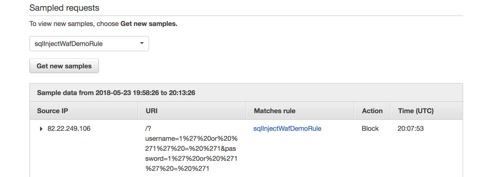

# Overview

This is a basic configuartion of a Web Application firewall (WAF). 

WAF can opperate in two modes, one where the WAF is placed in front of CloudFront and a second mode where it is placed in front of an Application Load Balancer (ALB).


The deployment sets up a basic WAF ACL with a rule to block SQL injection, however it is simple to extend to add additional rules for XXS or rate limiting.

The web servers are configured with the OWASP sample insecure application for testing, https://www.owasp.org/index.php/Category:OWASP_Insecure_Web_App_Project.

# Setup

To deploy the infratsructure utilise CloudFormation. To do this via the CLI run:

```
aws cloudformation create-stack --stack-name wafDemo --template-body file://./waf.yaml
```

The CloudFormation script will output the DNS name of the loadbalancer to allow web requests to bemade to test the WAF.

# Validate the install

To validate the installation make a request the ALB DNS name retrieved from the output of the stack, e.g.

```
wafDe-loadB-1GTSPSDDLWP0U-1581865168.eu-west-1.elb.amazonaws.com
```

# Testing

## SQL Injection

To test SQL injection append the following string to your web request:

```
/?username=1%27%20or%20%271%27%20=%20%271&password=1%27%20or%20%271%27%20=%20%271
```

Make a number of requests to generate some traffic in the logs.

After a period of time results will be visiable from either CloudWatch or via the WAF ACL requests dashboard. The results will be similar to the following:

Graph showing number of blocked requests


An example of a blocked request


# Contributing

Contribution to help demonstrate the WAF's capabilites are welcomed. Contributions should update the readme to explain how to test the rule.
